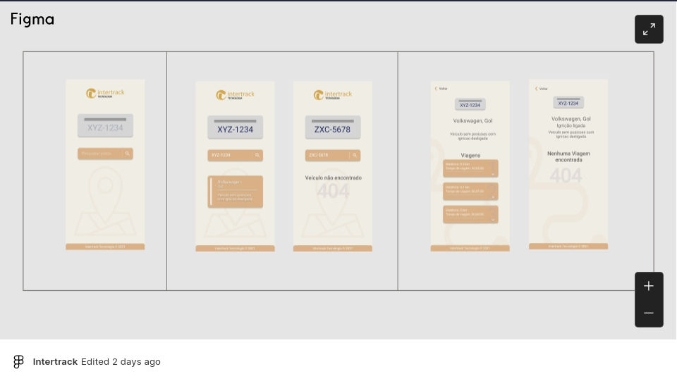

# Intertrack App

Aplicação Web que exibe as viagens de determinado veículo.

<div style="display: flex; justify-content: center;">
  <a href="https://www.figma.com/embed?embed_host=share&url=https%3A%2F%2Fwww.figma.com%2Ffile%2FBgoknEksV3IBdqRqNTHtyB%2FIntertrack%3Fnode-id%3D48%253A4">
    
  </a>
</div>


---
### 📦 Instalar dependências

```
$ yarn install
```

### 🔨 Como usar

Executar a seguir, inicia a App no modo de desenvolvimento

```bash
$ yarn start
```

Executar a seguir, inicia os testes da aplicação
> OBS: _É necessário que a execução anterior para isso_
```bash
$ yarn cypress
```

Executar a próxima compilação,  cria o aplicativo para uso em produção, que exporta arquivos em uma pasta `build` para implantar

```bash
$ yarn build
```
